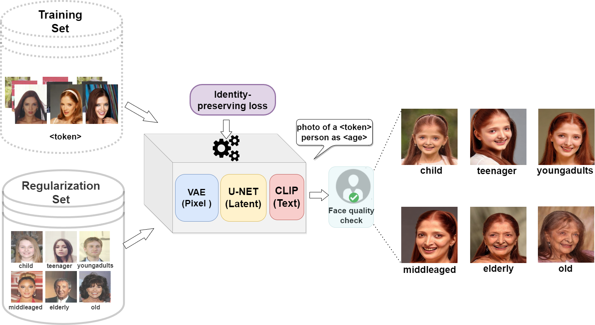

# ID-Preserving-Facial-Aging
This is the official implementation of **Identity-Preserving Aging of Face Images via Latent Diffusion Models** that has been accepted in International Joint Conference in Biometrics (IJCB 2023). Refer to [our paper](https://arxiv.org/abs/2307.08585).


## Usage
Create the `ldm` environment by following the steps outlined in [Dreambooth Stable Diffusion](https://github.com/XavierXiao/Dreambooth-Stable-Diffusion). Check `environment.yaml` file. Ensure that the environment is set up correctly before proceeding. 

## Training

### Model weights
We fine-tune a pre-trained stable diffusion model whose weights can be downloaded from [Hugging Face](https://huggingface.co/CompVis) model card. We use `sd-v1-4-full-ema.ckpt`. You can use any other model depending on your choice but we have not tested the reproducibility of the conference results with other models.

### Data preparation
We need a **Regularization Set** that comprises images depicting distinct individuals (disjoint from the training set) depicting variations in age. We curated a set of 612 images from the [CelebA-Dialog dataset](https://mmlab.ie.cuhk.edu.hk/projects/CelebA/CelebA_Dialog.html) that serves as image-caption pairs in this work. The six age labels used in this work are as follows.
- child
- teenager
- youngadults
- middleaged
- elderly
- old
  
Download the [Regularization Set](https://drive.google.com/file/d/1GmOjT5B-Dq2zstSm9DRafPMX9E7rByhd/view?usp=drive_link) used in our work or you can create your own regularization set but we cannot verify the performance with a custom regularization set. 

We need a **Training Set** that comprises images of a specific individual on whom the facial aging will be applied. The training set enables the diffusion model to learn the identity-specific charctristics during training that are then transferred at the time of generation of images with aging/de-aging. This repo currently supports single subject-specific training. You can create a custom batch script for training multiple subjects simultaneously, ensure that the rare token is linked to *each* subject uniquely, otherwise it may result in inconsistent outputs or identity lapse.   

### Fine-tuning using default Dreambooth

```
python main.py --base configs/stable-diffusion/v1-finetune_unfrozen.yaml 
                -t 
                --actual_resume /path/to/original/stable-diffusion/sd-v1-4-full-ema.ckpt  
                -n <job name> 
                --gpus 0, 
                --data_root /path-to-training-images-folder 
                --reg_data_root /path-to-regularization-images-folder
                --class_word person --no-test
```
### Fine-tuning using custom losses
- Biometric loss
  ```
  python main.py --base configs/stable-diffusion/v1-finetune_biomloss.yaml 
                -t 
                --actual_resume /path/to/original/stable-diffusion/sd-v1-4-full-ema.ckpt  
                -n <job name> 
                --gpus 0, 
                --data_root /path-to-training-images-folder
                --reg_data_root /path-to-regularization-images-folder
                --class_word person
  ```
- Contrastive loss
  ```
  python main.py --base configs/stable-diffusion/v1-finetune_contrastiveloss.yaml 
                -t 
                --actual_resume /path/to/original/stable-diffusion/sd-v1-4-full-ema.ckpt  
                -n <job_name> 
                --gpus 0, 
                --data_root /path-to-training-images-folder
                --reg_data_root /path-to-regularization-images-folder
                --class_word person
  ```

Note:
1. `personalized_captionandimage.py` modifies the original script to include image-caption pairs. The age caption comes from the filename of the regularization set images.
2. Change rare token in **line 11** of `personalized_captionandimage.py` and `personalized.py` to a rare identifier of your choice. It is currently set to *sks*.
3. After fine-tuning, the checkpoints will be saved in `./logs/<job_name>/checkpoints`. You can change the `max_steps` in the config file.

### Facial aging/de-aging synthesis

After the completion of fine-tuning, you can generate photo on the trained individual by specifying the rare-token identifier (must match training), the `--class_word` and `age-label` denotes one of the six age groups indicated above.
```
python scripts/stable_txt2img.py --ddim_eta 0.0 
                                 --n_samples 8 
                                 --n_iter 1 
                                 --scale 10.0 
                                 --ddim_steps 100  
                                 --ckpt /path-to-saved-checkpoint-from-training
                                 --prompt "photo of a <rare-token> <class> as <age-label>" 
```
### Evaluation

- We perform face quality check using [EQFace](https://github.com/deepcam-cn/FaceQuality) where we download the pretrained model provided by the original authors and run `python test_quality.py --backbone backbone.pth --quality quality.path --file test_faces`, where `test_faces` indicate the age translated faces. We select a threshold of 0.4 to determine if a generated face should be retained or else, discarded.
- We perform biometric matching (with ArcFace) and age computation using [deepface](https://github.com/serengil/deepface) library.
- We use the official implementation of [AttGAN](https://github.com/LynnHo/AttGAN-Tensorflow), [Talk-to-Edit](https://github.com/yumingj/Talk-to-Edit) and [IPCGAN](https://github.com/dawei6875797/Face-Aging-with-Identity-Preserved-Conditional-Generative-Adversarial-Networks) for baseline comparison.


## Acknowledgment
This repository is heavily dependent on code borrowed from [Dreambooth Stable Diffusion](https://github.com/XavierXiao/Dreambooth-Stable-Diffusion) repository. All changes made in the scripts and config files need to be incorporated to reproduce the results from the conference paper.

## Citation
If you find this code useful or utilize it in your work, please cite:
```
@INPROCEEDINGS {IDFaceAging_IJCB2023,
author = {Sudipta Banerjee* and Govind Mittal* and Ameya Joshi and Chinmay Hegde and Nasir Memon},
booktitle = {IEEE International Joint Conference on Biometrics (IJCB)},
title = {Identity-Preserving Aging of Face Images via Latent Diffusion Models},
year = {2023},
}
```
